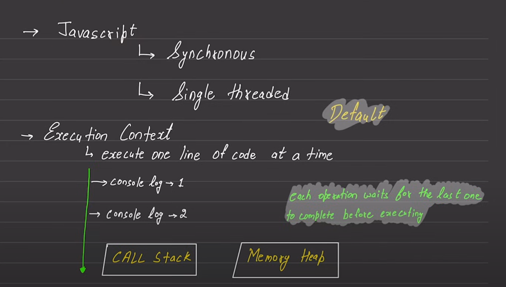

# Javascript Revision Notes

- [Basics - Part 1](#basics---part-1)
  - [1. Variables](#1-variables)
  - [2. Data Types](#2-data-types)
  - [3. Type Conversion and Operations](#3-type-conversion-and-operations)
  - [4. Strings](#4-strings)
  - [5. Numbers and Math](#5-numbers-and-math)
  - [6. Dates](#6-dates)
- [Basics - Part 2](#basics---part-2)
  - [1. Arrays](#1-arrays)
  - [2. Objects](#2-objects)
- [Basics - Part 3](#basics---part-3)
  - [1. Functions](#1-functions)
  - [2. Scopes in Functions](#2-scopes-in-functions)
  - [3. Arrow Functions](#3-arrow-functions)
  - [4. Immediately Invoked Function Expressions (IIFE)](#4-immediately-invoked-function-expressions-iife)
- [How JS Works](#how-js-works)
- [Call Stack](#call-stack)
- [Loops and Iteration](#loops-and-iteration)
  - [ES6 Array Methods](#es6-array-methods)
- [Additional Resources](#additional-resources)

## Basics - Part 1

### 1. Variables

In JavaScript, variables can be declared using `const`, `let`, or `var`.

```jsx
const accountId = 144553; // Declaring a constant
let accountEmail = "tushar@google.com"; // Declaring a variable (new way)
var accountPassword = "12345"; // Declaring a variable (old way)
let accountState;
console.log(accountState); // Output: undefined
```

Without strict mode:

```jsx
num = 5; // The variable "num" is created if it didn't exist
```

### 2. Data Types

JavaScript has eight basic data types.

#### Primitive Data Types

Primitive data types are the most basic data types in JavaScript.

##### i. Number

The `number` type is used for both integer and floating-point values.

```jsx
let n = 123;
n = 12.345;
```

Special numeric values include `Infinity`, `-Infinity`, and `NaN`.

Number capacity: \(2^{53} - 1\)

##### ii. BigInt

`BigInt` is used for integers of arbitrary length.

```jsx
// The "n" at the end indicates a BigInt
const bigInt = 1234567890123456789012345678901234567890n;
```

##### iii. String

A `string` represents textual data.

```jsx
let str = "Hello";
let str2 = "Single quotes are ok too";
let phrase = `can embed another ${str}`;
```

Backticks (``) allow embedding variables and expressions into a string:

```jsx
let name = "John";

// Embed a variable
alert(`Hello, ${name}!`); // Hello, John!

// Embed an expression
alert(`The result is ${1 + 2}`); // The result is 3
```

##### iv. Boolean

The `boolean` type has only two values: `true` and `false`.

##### v. Null

`null` represents “nothing”, “empty” or “value unknown”.

```jsx
let age = null;
```

##### vi. Undefined

`undefined` means a value is not assigned. If a variable is declared but not assigned, its value is `undefined`:

```jsx
let age;
alert(age); // Shows "undefined"
```

##### vii. Symbol

The `symbol` type is used to create unique identifiers for objects.

##### viii. Object

Objects are a non-primitive data type used for storing collections of data and more complex entities.

#### Non-Primitive Data Types

Non-primitive data types can hold multiple values and are mutable.

##### i. Arrays

Arrays are used to store multiple values in a single variable.

```jsx
const heros = ["Ironman", "Thor", "Loki"];
```

##### ii. Objects

Objects store key-value pairs and are used to represent real-world entities.

```jsx
let myObj = {
  name: "Tushar",
  age: 22,
};
```

##### iii. Functions

Functions are blocks of code designed to perform a particular task.

```jsx
const myFunction = function () {
  console.log("Hello world");
};
```

#### The `typeof` Operator

The `typeof` operator returns the type of the operand.

```jsx
typeof undefined; // "undefined"
typeof 0; // "number"
typeof 10n; // "bigint"
typeof true; // "boolean"
typeof "foo"; // "string"
typeof Symbol("id"); // "symbol"
typeof Math; // "object"  (1)
typeof null; // "object"  (2)
typeof alert; // "function"  (3)
typeof heros; // "object"
typeof myObj; // "object"
typeof myFunction; // "function"
```

---

Notes:

1. `typeof Math` returns `"object"` because `Math` is a built-in object.
2. `typeof null` returns `"object"` due to a legacy bug in JavaScript.
3. `typeof alert` and `typeof myFunction` return `"function"` because functions are objects in JavaScript.

### 3. Type Conversion and Operations

#### i. Converting to Number

You can convert a string or boolean to a number using the `Number()` function.

```jsx
let score = "tushar";
console.log(typeof score); // "string"
console.log(typeof Number(score)); // "number"

let valueInNumber = Number(score);
console.log(valueInNumber); // NaN (because "tushar" cannot be converted to a number)
```

Examples:

- `"33"` → `33`
- `"33abc"` → `NaN`
- `true` → `1`, `false` → `0`

##### ii. Converting to Boolean

You can convert other types to a boolean using the `Boolean()` function.

```jsx
let isLoggedIn = "tushar";
let booleanIsLoggedIn = Boolean(isLoggedIn);
console.log(booleanIsLoggedIn); // true
```

Examples:

- `1` → `true`, `0` → `false`
- `""` (empty string) → `false`
- `"tushar"` → `true`

##### iii. Converting to String

You can convert numbers or other types to a string using the `String()` function.

```jsx
let someNumber = 33;
let stringNumber = String(someNumber);
console.log(stringNumber); // "33"
console.log(typeof stringNumber); // "string"
```

#### Operations

JavaScript supports various arithmetic and string operations.

##### i. Basic Arithmetic Operations

```jsx
let value = 3;
let negValue = -value;
console.log(negValue); // -3

console.log(2 + 2); // 4
console.log(2 - 2); // 0
console.log(2 * 2); // 4
console.log(2 ** 3); // 8 (exponentiation)
console.log(2 / 3); // 0.6666666666666666
console.log(2 % 3); // 2 (remainder)
```

##### ii. String Concatenation

```jsx
let str1 = "hello";
let str2 = " tushar";

let str3 = str1 + str2;
console.log(str3); // "hello tushar"
```

##### iii. Type Coercion in Operations

JavaScript automatically converts data types in certain operations.

```jsx
console.log("1" + 2); // "12"
console.log(1 + "2"); // "12"
console.log("1" + 2 + 2); // "122"
console.log(1 + 2 + "2"); // "32"
```

##### iv. Unary Plus (`+`) Operator

The unary plus (`+`) operator converts its operand to a number.

```jsx
console.log(+true); // 1
console.log(+""); // 0
```

##### v. Multiple Assignments

You can assign values to multiple variables at once.

```jsx
let num1, num2, num3;
num1 = num2 = num3 = 2 + 2;
console.log(num1, num2, num3); // 4 4 4
```

##### vi. Increment Operator

The increment operator (`++`) increases the value of a variable by one.

```jsx
let gameCounter = 100;
++gameCounter;
console.log(gameCounter); // 101
```

---

### 4. Strings

String can also be created `String` constructor:

```jsx
const gameName = new String("tushar-ta-com");

// Accessing individual characters
console.log(gameName[0]); // "h"

// Accessing properties and methods
console.log(gameName.__proto__); // String prototype
console.log(gameName.length); // 13
console.log(gameName.toUpperCase()); // "TUSHAR-TA-COM"
console.log(gameName.charAt(2)); // "s"
console.log(gameName.indexOf("s")); // 2
```

#### String Methods

JavaScript provides several methods to manipulate strings:

```jsx
// Extracting a substring
const newString = gameName.substring(0, 4);
console.log(newString); // "tush"

// Slicing a string (can use negative indices)
const anotherString = gameName.slice(-8, 4);
console.log(anotherString); // ""

// Trimming whitespace
const newStringOne = "   tushar    ";
console.log(newStringOne.trim()); // "tushar"

// Replacing parts of a string
const url = "https://tushar.com/tushar%20agrawal";
console.log(url.replace("%20", "-")); // "https://tushar.com/tushar-agrawal"

// Checking for substring inclusion
console.log(url.includes("sundar")); // false

// Splitting a string into an array
console.log(gameName.split("-")); // ["tushar", "ta", "com"]
```

---

### 5. Numbers and Math

```jsx
const score = 400;
console.log(score);

const balance = new Number(100);
console.log(balance.toString().length); // 3
console.log(balance.toFixed(1)); // "100.0"
```

#### Number Methods

```jsx
const otherNumber = 123.8966;
console.log(otherNumber.toPrecision(4)); // "123.9"

const hundreds = 1000000;
console.log(hundreds.toLocaleString("en-IN")); // "10,00,000"
```

#### Random Numbers

```jsx
console.log(Math.random()); // Random number between 0 and 1
console.log(Math.floor(Math.random() * 10) + 1); // Random number between 1 and 10

const min = 10;
const max = 20;
console.log(Math.floor(Math.random() * (max - min + 1)) + min); // Random number between 10 and 20
```

---

### 6. Dates

```jsx
let myDate = new Date();
console.log(myDate.toString()); // Current date and time as a string
console.log(myDate.toDateString()); // Current date as a string (e.g., "Wed Jan 23 2023")
console.log(myDate.toLocaleString()); // Locale-specific date and time string
console.log(typeof myDate); // "object"

// Creating specific dates
let myCreatedDate = new Date("01-14-2023");
console.log(myCreatedDate.toLocaleString()); // "14/01/2023, 00:00:00"
```

#### Timestamps

You can get the current timestamp or convert dates to timestamps:

```jsx
let myTimeStamp = Date.now();
console.log(myTimeStamp); // Current timestamp in milliseconds

console.log(myCreatedDate.getTime()); // Timestamp for the created date

// Current timestamp in seconds
console.log(Math.floor(Date.now() / 1000));
```

#### Date Methods

```jsx
let newDate = new Date();
console.log(newDate.getMonth() + 1); // Current month (1-12)
console.log(newDate.getDay()); // Day of the week (0-6, where 0 is Sunday)

// Getting the weekday as a string
console.log(newDate.toLocaleString("default", { weekday: "long" })); // E.g., "Wednesday"
```

---

## Basics - Part 2

### 1. Arrays

```javascript
const myArr = [0, 1, 2, 3, 4, 5];
const myHeors = ["shaktiman", "naagraj"];

const myArr2 = new Array(1, 2, 3, 4); // Creates an array with elements 1, 2, 3, 4
```

#### Array Methods

- **Push and Pop:** Add or remove elements from the end of the array.

```javascript
myArr.push(6); // Adds 6 to the end of the array
myArr.pop(); // Removes the last element
```

- **Unshift and Shift:** Add or remove elements from the beginning of the array.

```javascript
myArr.unshift(9); // Adds 9 to the beginning
myArr.shift(); // Removes the first element
```

- **Includes and IndexOf:** Check for the presence of an element or find its index.

```javascript
console.log(myArr.includes(9)); // Checks if 9 is in the array
console.log(myArr.indexOf(3)); // Returns the index of 3
```

- **Join:** Convert an array into a string.

```javascript
const newArr = myArr.join(); // Joins elements with a comma
console.log(newArr); // "0,1,2,3,4,5"
```

#### Shallow Copy and Deep Copy

- A shallow copy of an object is a copy whose properties share the same references (point to the same underlying values) as those of the source object from which the copy was made. As a result, when you change either the source or the copy, you may also cause the other object to change too.

- A deep copy of an object is a copy whose properties do not share the same references (point to the same underlying values) as those of the source object from which the copy was made. As a result, when you change either the source or the copy, you can be assured you're not causing the other object to change too.

#### Slice and Splice

- **Slice:** Returns a shallow copy of a portion of an array.

```javascript
const myn1 = myArr.slice(1, 3); // Returns elements from index 1 to 2
console.log(myn1); // [1, 2]
```

- **Splice:** Modifies the array by removing or replacing elements.

```javascript
const myn2 = myArr.splice(1, 3); // Removes 3 elements starting from index 1
console.log(myn2); // [1, 2, 3]
```

#### Combining Arrays

- **Concat:** Combine two arrays.

```javascript
const marvel_heros = ["thor", "Ironman", "spiderman"];
const dc_heros = ["superman", "flash", "batman"];

const allHeros = marvel_heros.concat(dc_heros);
console.log(allHeros); // ["thor", "Ironman", "spiderman", "superman", "flash", "batman"]
```

- **Spread Operator:** Another way to combine arrays.

```javascript
const all_new_heros = [...marvel_heros, ...dc_heros];
console.log(all_new_heros); // Same as allHeros
```

#### Other Useful Methods

- **Flat:** Flattens nested arrays.

```javascript
const another_array = [1, 2, 3, [4, 5, 6], 7, [6, 7, [4, 5]]];
const real_another_array = another_array.flat(Infinity);
console.log(real_another_array); // [1, 2, 3, 4, 5, 6, 7, 6, 7, 4, 5]
```

- **Array.isArray:** Checks if a value is an array.

```javascript
console.log(Array.isArray("tushar")); // false
```

- **Array.from:** Creates an array from an iterable.

```javascript
console.log(Array.from("tushar")); // ["H", "i", "t", "e", "s", "h"]
```

- **Array.of:** Creates an array from arguments.

```javascript
let score1 = 100,
  score2 = 200,
  score3 = 300;
console.log(Array.of(score1, score2, score3)); // [100, 200, 300]
```

---

### 2. Objects

```javascript
const mySym = Symbol("key1");

const JsUser = {
  name: "tushar",
  "full name": "tushar agrawal",
  [mySym]: "mykey1",
  age: 18,
  location: "Jaipur",
  email: "tushar@google.com",
  isLoggedIn: false,
  lastLoginDays: ["Monday", "Saturday"],
};
```

#### Accessing Object Properties

- Using dot notation and bracket notation:

```javascript
console.log(JsUser.email); // "tushar@google.com"
console.log(JsUser["full name"]); // "tushar agrawal"
console.log(JsUser[mySym]); // "mykey1"
```

#### Modifying Objects

- **Object.freeze:** Prevents modification to the object.

```javascript
JsUser.email = "tushar@chatgpt.com";
Object.freeze(JsUser);
JsUser.email = "tushar@microsoft.com"; // Will not change due to freeze
console.log(JsUser.email); // "tushar@chatgpt.com"
```

#### Methods in Objects

- **Adding methods:**

```javascript
JsUser.greeting = function () {
  console.log("Hello JS user");
};
JsUser.greetingTwo = function () {
  console.log(`Hello JS user, ${this.name}`);
};

console.log(JsUser.greeting()); // "Hello JS user"
console.log(JsUser.greetingTwo()); // "Hello JS user, tushar"
```

#### Working with Multiple Objects

- **Merging Objects:**

```javascript
const obj1 = { 1: "a", 2: "b" };
const obj2 = { 3: "a", 4: "b" };

const obj3 = { ...obj1, ...obj2 }; // Merging obj1 and obj2
console.log(obj3); // {1: "a", 2: "b", 3: "a", 4: "b"}
```

#### Object Utilities

- **Keys, Values, Entries:**

```javascript
console.log(Object.keys(JsUser)); // ["name", "full name", "age", "location", "email", "isLoggedIn", "lastLoginDays"]
console.log(Object.values(JsUser)); // ["tushar", "tushar agrawal", 18, "Jaipur", "tushar@chatgpt.com", false, ["Monday", "Saturday"]]
console.log(Object.entries(JsUser)); // [["name", "tushar"], ["full name", "tushar agrawal"], ...]
```

- **Destructuring:**

```javascript
const course = {
  coursename: "js in hindi",
  price: "999",
  courseInstructor: "tushar",
};

const { courseInstructor: instructor } = course;
console.log(instructor); // "tushar"
```

---

## Basics - Part 3

### 1. Functions

```javascript
function sayMyName() {
  console.log("T");
  console.log("U");
  console.log("S");
  console.log("H");
  console.log("A");
  console.log("R");
}

sayMyName();
```

#### Function with Parameters

```javascript
function addTwoNumbers(number1, number2) {
  return number1 + number2;
}

const result = addTwoNumbers(3, 5);
console.log("Result: ", result); // Result: 8
```

#### Default Parameters

- Default values can be assigned to parameters in case no argument is passed.

```javascript
function loginUserMessage(username = "sam") {
  if (!username) {
    console.log("Please enter a username");
    return;
  }
  return `${username} just logged in`;
}

console.log(loginUserMessage("tushar")); // tushar just logged in
console.log(loginUserMessage()); // sam just logged in
```

#### Rest Parameters

- Rest parameters allow functions to accept an indefinite number of arguments as an array.

```javascript
function calculateCartPrice(val1, val2, ...num1) {
  return num1;
}

console.log(calculateCartPrice(200, 400, 500, 2000)); // [500, 2000]
```

#### Function as Object Methods

- Functions can be defined as methods within objects.

```javascript
const user = {
  username: "tushar",
  price: 199,

  welcomeMessage: function () {
    console.log(`${this.username}, welcome to the website`);
  },
};

user.welcomeMessage(); // tushar, welcome to the website
```

---

### 2. Scopes in Functions

- Variables declared within a function are in the function's local scope, while those declared outside are in the global scope.

```javascript
function one() {
  const username = "tushar";

  function two() {
    const website = "youtube";
    console.log(username); // Accessible due to closure
  }

  two();
}

one();

// console.log(username); // Error: username is not defined
```

#### `let` vs `var`

#### Scoping Rules

- **`var`: Function Scope**

  Variables declared with `var` are scoped to the immediate function body they are declared in. If declared outside a function, they are globally scoped.

- **`let`: Block Scope**

  Variables declared with `let` are scoped to the immediate enclosing block, denoted by `{ }`. This means they are only accessible within the block they are defined in.

```javascript
function run() {
  var foo = "Foo";
  let bar = "Bar";

  console.log(foo, bar); // Foo Bar

  {
    var moo = "Mooo";
    let baz = "Bazz";
    console.log(moo, baz); // Mooo Bazz
  }

  console.log(moo); // Mooo
  console.log(baz); // ReferenceError
}

run();
```

- In the above code, `moo` is accessible outside the block because it is declared with `var`, which is function-scoped.
- `baz`, declared with `let`, is block-scoped, and hence trying to access it outside the block results in a `ReferenceError`.

#### Why `let` Was Introduced

- **Function Scope Confusion:**
  The primary reason `let` was introduced is that function scope can be confusing and is a common source of bugs in JavaScript.

```javascript
var funcs = [];
for (var i = 0; i < 3; i++) {
  funcs[i] = function () {
    console.log("My value: " + i);
  };
}
for (var j = 0; j < 3; j++) {
  funcs[j]();
}
```

- **Output:**

  - `My value: 3`
  - `My value: 3`
  - `My value: 3`

- **Explanation:**
  Here, all the functions in the `funcs` array log `3` because `var` is function-scoped, so the loop variable `i` is shared across all iterations. When the functions are called, they all reference the same `i` value, which is `3` after the loop ends.

- **Solution with `let`:**
  By using `let`, each iteration has its own block-scoped `i`.

#### Hoisting

- **`var` Hoisting:**
  Variables declared with `var` are hoisted to the top of their scope and are initialized as `undefined`. This means they can be accessed before the declaration, but their value will be `undefined`.

```javascript
function checkHoisting() {
  console.log(foo); // undefined
  var foo = "Foo";
  console.log(foo); // Foo
}

checkHoisting();
```

- **`let` Hoisting:**
  Variables declared with `let` are also hoisted, but they are not initialized. Accessing them before their declaration results in a `ReferenceError`. This behavior is known as being in the "temporal dead zone" (TDZ).

```javascript
function checkHoisting() {
  console.log(foo); // ReferenceError
  let foo = "Foo";
  console.log(foo); // Foo
}

checkHoisting();
```

#### Creating Global Object Property

- **`var` Creates Global Properties:**
  When `var` is used at the top level, it creates a property on the global object (`window` in browsers).

- **`let` Does Not Create Global Properties:**
  `let` does not create a property on the global object, even when used at the top level.

```javascript
var foo = "Foo"; // Globally scoped
let bar = "Bar"; // Globally scoped but not part of the global object

console.log(window.foo); // Foo
console.log(window.bar); // undefined
```

#### Redeclaration

- **`var` Allows Redeclaration:**
  In strict mode, `var` allows you to redeclare the same variable within the same scope.

- **`let` Does Not Allow Redeclaration:**
  `let` raises a `SyntaxError` if you try to redeclare the same variable in the same scope.

```javascript
"use strict";
var foo = "foo1";
var foo = "foo2"; // No problem, 'foo1' is replaced with 'foo2'.

let bar = "bar1";
let bar = "bar2"; // SyntaxError: Identifier 'bar' has already been declared
```

### Closure and Lexical Scope

#### What is Lexical Scope?

- **Lexical scope** refers to the way variables and functions are organized and accessed in nested functions. In JavaScript, a function's scope is defined by where it is written in the code. This determines what variables are accessible inside that function.
- In simple words it determines which variables are accessible in nested functions based on where the function is declared.

#### What is a Closure?

- A **closure** is a feature in JavaScript where an inner function has access to variables and parameters from its outer (enclosing) function, even after the outer function has finished executing. Closures allow functions to "remember" their environment, or scope, even when they're called outside of that original scope.

**Example:**

```javascript
function outerFunction() {
  let outerVariable = "I am from the outer function";

  function innerFunction() {
    console.log(outerVariable); // Accessing the outer function's variable
  }

  return innerFunction;
}

const myClosure = outerFunction(); // outerFunction runs and returns innerFunction
myClosure(); // "I am from the outer function"
```

- **outerFunction:** Declares a variable `outerVariable` and defines an `innerFunction`.
- **innerFunction:** Is returned by `outerFunction` and stored in `myClosure`.
- **myClosure:** Even though `outerFunction` has finished, `myClosure` (which is `innerFunction`) still has access to `outerVariable` due to the closure.

**Example: Button Click Handlers**

```html
<!DOCTYPE html>
<html lang="en">
  <head>
    <meta charset="UTF-8" />
    <meta name="viewport" content="width=device-width, initial-scale=1.0" />
    <title>Closure Example</title>
  </head>
  <body style="background-color: #313131;">
    <button id="orange">Orange</button>
    <button id="green">Green</button>

    <script>
      function clickHandler(color) {
        return function () {
          document.body.style.backgroundColor = color;
        };
      }

      document.getElementById("orange").onclick = clickHandler("orange");
      document.getElementById("green").onclick = clickHandler("green");
    </script>
  </body>
</html>
```

- **clickHandler:** This outer function takes a color as an argument.
- **Returned Function:** The inner function returned by `clickHandler` changes the background color using the passed `color` value.
- **Closure in Action:** When you click a button, the event handler uses the closure to access the color specified when `clickHandler` was originally called.

---

### 3. Arrow Functions

- In regular functions, `this` refers to the object that is calling the function.

```js
const user = {
  name: "tushar",
  greet: function () {
    console.log(this.name); // 'this' refers to the 'user' object
  },
};

user.greet(); // Output: "tushar"
user.name = "sam";
user.greet(); // output: "sam"
```

- Arrow functions provide a shorter syntax and do not have their own `this`.
- Instead, they inherit `this` from the surrounding lexical context (where the arrow function is defined).

```js
const user = {
  name: "tushar",
  greet: () => {
    console.log(this.name); // 'this' refers to the outer context, not the 'user' object
  },
};

user.greet(); // Output: undefined
```

```javascript
const chai = () => {
  console.log(this); // output : {}, because it takes outer context instead of chai() context
};

chai();
```

---

### 4. Immediately Invoked Function Expressions (IIFE)

- IIFE are functions that are executed immediately after they are defined.

```javascript
(function chai() {
  console.log("DB CONNECTED");
})();

((name) => {
  console.log(`DB CONNECTED TWO ${name}`);
})("tushar");
```

Why IIFE ?

- An IIFE immediately executes and does not leave a trace behind in the global scope.
- Variables and functions inside an IIFE are scoped to the function itself, avoiding conflicts with other variables or functions in the global scope.

- `Global Scope Protection:` IIFE helps prevent variable name collisions by not polluting the global namespace.
- `Data Privacy:` Variables inside an IIFE are not accessible outside, which helps in keeping data private.
- `Immediate Execution:` IIFE is useful for code that needs to run immediately without having to be invoked later.

---

## How JS Works

## Call Stack

## Loops and Iteration

1. **`for...of` Loop**:

   - Iterates over iterable objects like arrays or strings. (not object)
   - Example:

     ```javascript
     const arr = [1, 2, 3, 4, 5];
     for (const num of arr) {
       console.log(num); // 1, 2, 3, 4, 5
     }

     const greetings = "Hello world!";
     for (const greet of greetings) {
       console.log(`Each char is ${greet}`);
     }
     ```

2. **`for...in` Loop**:

   - Iterates over the keys (property names) of an object. (also works for array)
   - Example:

     ```javascript
     const myObject = {
       js: "javascript",
       cpp: "C++",
       rb: "ruby",
       swift: "swift by apple",
     };

     for (const key in myObject) {
       console.log(`${key} shortcut is for ${myObject[key]}`);
     }
     ```

3. **`forEach` Method**:

   - Executes a provided function once for each array element.
   - Example:

     ```javascript
     const coding = ["js", "ruby", "java", "python", "cpp"];
     coding.forEach((item) => {
       console.log(item);
     });

     const myCoding = [
       { languageName: "javascript", languageFileName: "js" },
       { languageName: "java", languageFileName: "java" },
       { languageName: "python", languageFileName: "py" },
     ];

     myCoding.forEach((item) => {
       console.log(item.languageName); // output: javascript, java, python
     });
     ```

   ### Maps

   - `Map` is a collection of keyed data items, like an object. However, a `Map` allows keys of any type.
   - Example:

     ```javascript
     const map = new Map();
     map.set("IN", "India");
     map.set("USA", "United States of America");
     map.set("Fr", "France");

     for (const [key, value] of map) {
       console.log(key, ":-", value);
     }
     ```

### ES6 Array Methods

1. **`filter` Method**:

   - Creates a new array with all elements that pass the test implemented by the provided function.

   ```js
   const myNums = [1, 2, 3, 4, 5, 6, 7, 8, 9, 10];
   const newNums = myNums.filter((num) => {
     return num > 4;
   }); // output: [5,6,7....]
   ```

   ```javascript
   const books = [
     {
       title: "Book One",
       genre: "Fiction",
       publish: 1981,
       edition: 2004,
     },
     {
       title: "Book Two",
       genre: "Non-Fiction",
       publish: 1992,
       edition: 2008,
     },
     {
       title: "Book Three",
       genre: "History",
       publish: 1999,
       edition: 2007,
     },
     {
       title: "Book Four",
       genre: "Non-Fiction",
       publish: 1989,
       edition: 2010,
     },
     {
       title: "Book Five",
       genre: "Science",
       publish: 2009,
       edition: 2014,
     },
     {
       title: "Book Six",
       genre: "Fiction",
       publish: 1987,
       edition: 2010,
     },
     {
       title: "Book Seven",
       genre: "History",
       publish: 1986,
       edition: 1996,
     },
     {
       title: "Book Eight",
       genre: "Science",
       publish: 2011,
       edition: 2016,
     },
     {
       title: "Book Nine",
       genre: "Non-Fiction",
       publish: 1981,
       edition: 1989,
     },
   ];

   let userBooks = books.filter((bk) => bk.genre === "History");
   userBooks = books.filter(
     (bk) => bk.publish >= 1995 && bk.genre === "History"
   );

   console.log(userBooks);
   ```

2. **`map` Method**:

   - Creates a new array populated with the results of calling a provided function on every element in the calling array.

   ```js
   const myNumers = [1, 2, 3, 4, 5, 6, 7, 8, 9, 10];
   const newNums = myNumers.map((num) => {
     return num + 10;
   }); // [11, 12, 13,...]
   ```

   ```javascript
   const myNumbers = [1, 2, 3, 4, 5, 6, 7, 8, 9, 10];

   const newNums = myNumbers
     .map((num) => num * 10)
     .map((num) => num + 1)
     .filter((num) => num >= 40);

   console.log(newNums); // [41, 51, 61, 71, 81, 91, 101]
   ```

3. **`reduce` method**:

   - The `reduce` method in JavaScript is used to accumulate a single output value from an array. It applies a function against an accumulator and each element in the array (from left to right) to reduce it to a single value.

   ```js
   const myNums = [1, 2, 3];
   const myTotal = myNums.reduce((acc, curr) => acc + curr, 0);
   console.log(myTotal); // Output: 6
   ```

   - **Explanation**:

     - **Accumulator (`acc`)**: This is the accumulated value previously returned in the last invocation of the callback or the initial value if provided.
     - **Current Value (`curr`)**: The current element being processed in the array.
     - **Initial Value (`0`)**: The initial value to start the accumulation. This will `acc` value in first iteration.

   - **Process**:
     - First iteration: `acc = 0`, `curr = 1` → `acc + curr = 1`
     - Second iteration: `acc = 1`, `curr = 2` → `acc + curr = 3`
     - Third iteration: `acc = 3`, `curr = 3` → `acc + curr = 6`
     - The final result is `6`.

   #### Example with an Array of Objects

   ```javascript
   const shoppingCart = [
     { itemName: "js course", price: 2999 },
     { itemName: "py course", price: 999 },
     { itemName: "mobile dev course", price: 5999 },
     { itemName: "data science course", price: 12999 },
   ];

   const priceToPay = shoppingCart.reduce((acc, item) => acc + item.price, 0);

   console.log(priceToPay); // Output: 22996
   ```

---

## DOM (Document Object Model)

### 1. DOM Introduction

The Document Object Model (DOM) is a programming interface for HTML and XML documents. It represents the structure of a document as a tree of objects that can be manipulated with JavaScript.

- The DOM allows scripts to update the content, structure, and style of a document.
- It represents the document as a hierarchical tree of nodes.

### 2. DOM Tree

The DOM tree is a tree-like structure where:

- **Document** is the root of the tree.
- **Elements** are the nodes in the tree.
- **Attributes** and **Text** are the properties of the elements.

### Example of a DOM Tree

```html
<!DOCTYPE html>
<html>
  <head>
    <title>Page Title</title>
  </head>
  <body>
    <h1>My First Heading</h1>
    <p>My first paragraph.</p>
    <a href="https://example.com">Link</a>
  </body>
</html>
```

**DOM Tree Structure:**

- `document`
  - `html`
    - `head`
      - `title`
    - `body`
      - `h1`
      - `p`
      - `a`

### 3. Selecting Elements

#### 3.1 By ID

```javascript
let element = document.getElementById("myId");
```

#### 3.2 By Class

Selects all elements with a specified class name. Returns an HTMLCollection.

```javascript
let elements = document.getElementsByClassName("myClass"); // return an HTMLCOllection
```

#### 3.3 By Tag Name

Selects all elements with a specified tag name. Returns an HTMLCollection.

```javascript
let elements = document.getElementsByTagName("p");
```

#### 3.4 By `querySelector`

Selects the first element that matches a specified CSS selector.

```javascript
let element = document.querySelector(".myClass");
```

#### 3.5 By `querySelectorAll`

Selects all elements that match a specified CSS selector. Returns a NodeList.

```javascript
let elements = document.querySelectorAll(".myClass");
```

### 4. Attributes

#### 4.1 `getAttribute`

Gets the value of an attribute on the specified element.

```javascript
let value = element.getAttribute("href");
```

#### 4.2 `setAttribute`

Sets the value of an attribute on the specified element.

```javascript
element.setAttribute("href", "https://new-url.com");
```

### 5. Styling an Element

```javascript
element.style.color = "red";
element.style.fontSize = "20px";
```

### 6. Setting Content of an Element

#### 6.1 `textContent`

Sets or returns the text content of an element, including its descendants. It ignores HTML tags.

```javascript
element.textContent = "New Text";
```

#### 6.2 `innerHTML`

Sets or returns the HTML content of an element, including its descendants. It parses the text as HTML, so it's possible to include tags.

```javascript
element.innerHTML = "<strong>Bold Text</strong>";
```

#### 6.3 `innerText`

Similar to `textContent`, but it returns the visible text, ignoring hidden elements or CSS styles like `display: none`.

```javascript
element.innerText = "New Visible Text";
```

**Difference between `textContent`, `innerHTML`, and `innerText`:**

- `textContent`: Includes all text within an element, ignoring HTML tags.
- `innerHTML`: Allows you to set or get HTML content, including tags.
- `innerText`: Returns only the visible text within an element, respecting CSS styles.

### 7. NodeList, HTMLCollection, and Array

#### 7.1 NodeList

A NodeList is a collection of nodes returned by methods like `querySelectorAll`. It can be traversed using `forEach`, `for of`, or index-based access.

```javascript
let elements = document.querySelectorAll(".myClass");
elements.forEach((element) => console.log(element));
```

#### 7.2 HTMLCollection

An HTMLCollection is a collection of elements returned by methods like `getElementsByClassName` or `getElementsByTagName`. It can only be traversed using `for of` or index-based access.

```javascript
let elements = document.getElementsByClassName("myClass");
for (let element of elements) {
  console.log(element);
}
```

#### 7.3 Array

Neither NodeList nor HTMLCollection are true arrays, but they can be converted to arrays using `Array.from` or the spread operator `[...]`.

```javascript
let elementsArray = Array.from(document.querySelectorAll(".myClass"));
elementsArray.forEach((element) => console.log(element));

// Using the spread operator
let elementsArray2 = [...document.getElementsByClassName("myClass")];
elementsArray2.forEach((element) => console.log(element));
```

### Traversing NodeList, HTMLCollection, and Array

- **NodeList**: Can be traversed using `forEach`, `for of`, or traditional loops.
- **HTMLCollection**: Can be traversed using `for of` or traditional loops.
- **Array**: Full array methods like `map`, `filter`, `reduce`, etc., can be used.

---

### Example 1: DOM Manipulation and Traversal

```html
<!DOCTYPE html>
<html lang="en">
  <head>
    <meta charset="UTF-8" />
    <meta http-equiv="X-UA-Compatible" content="IE=edge" />
    <meta name="viewport" content="width=device-width, initial-scale=1.0" />
    <title>DOM | Chai aur code</title>
  </head>
  <body style="background-color: #212121; color: #fff;">
    <div class="parent">
      <!-- this is a comment -->
      <div class="day">Monday</div>
      <div class="day">Tuesday</div>
      <div class="day">Wednesday</div>
      <div class="day">Thursday</div>
    </div>
  </body>
  <script>
    const parent = document.querySelector(".parent");

    // Accessing children of the parent element
    console.log(parent.children); // Logs HTMLCollection of child elements
    console.log(parent.children[1].innerHTML); // Logs "Tuesday"

    // Iterating over children
    for (let i = 0; i < parent.children.length; i++) {
      console.log(parent.children[i].innerHTML); // Logs each day's name
    }

    // Modifying the style of a specific child
    parent.children[1].style.color = "orange"; // Changes color of "Tuesday" to orange

    // Accessing first and last child
    console.log(parent.firstElementChild); // Logs first child ("Monday")
    console.log(parent.lastElementChild); // Logs last child ("Thursday")

    const dayOne = document.querySelector(".day");
    console.log(dayOne); // Logs the first element with class "day" ("Monday")
    console.log(dayOne.parentElement); // Logs the parent of "Monday" (the .parent div)
    console.log(dayOne.nextElementSibling); // Logs the next sibling ("Tuesday")

    console.log("NODES: ", parent.childNodes); // Logs all child nodes, including text and comment nodes
  </script>
</html>
```

### Key Concepts:

1. **Selecting Elements:**

   - `document.querySelector('.parent')`: Selects the first element with the class "parent".
   - `document.querySelector('.day')`: Selects the first element with the class "day".

2. **Traversing the DOM:**

   - `parent.children`: Returns an HTMLCollection of all child elements within the parent.
   - `parent.firstElementChild` and `parent.lastElementChild`: Return the first and last child elements.
   - `dayOne.parentElement`: Accesses the parent of the selected element.
   - `dayOne.nextElementSibling`: Gets the next sibling element.

3. **Modifying DOM Elements:**
   - `parent.children[1].style.color = "orange"`: Changes the color of the second child element.
   - `parent.childNodes`: Returns a NodeList of all child nodes, including text and comment nodes.

---

### Example 2: Creating and Appending DOM Elements

```html
<!DOCTYPE html>
<html lang="en">
  <head>
    <meta charset="UTF-8" />
    <meta http-equiv="X-UA-Compatible" content="IE=edge" />
    <meta name="viewport" content="width=device-width, initial-scale=1.0" />
    <title>Chai aur code</title>
  </head>
  <body style="background-color: #212121; color: #fff;"></body>
  <script>
    const div = document.createElement("div");
    console.log(div); // Logs the newly created div element

    // Setting attributes and styles
    div.className = "main";
    div.id = Math.round(Math.random() * 10 + 1); // Sets a random id
    div.setAttribute("title", "generated title");
    div.style.backgroundColor = "green";
    div.style.padding = "12px";

    // Adding text content to the div
    const addText = document.createTextNode("Chai aur code");
    div.appendChild(addText);

    // Appending the div to the body
    document.body.appendChild(div);
  </script>
</html>
```

### Key Concepts:

1. **Creating Elements:**

   - `document.createElement("div")`: Creates a new `div` element.

2. **Setting Attributes:**

   - `div.className = "main"`: Sets the class of the element.
   - `div.id = ...`: Assigns a random id to the element.
   - `div.setAttribute("title", "generated title")`: Sets the title attribute.

3. **Styling Elements:**

   - `div.style.backgroundColor = "green"`: Sets the background color.
   - `div.style.padding = "12px"`: Adds padding to the element.

4. **Adding Text:**

   - `document.createTextNode("Chai aur code")`: Creates a text node with the content "Chai aur code".
   - `div.appendChild(addText)`: Appends the text node to the `div`.

5. **Appending to the DOM:**
   - `document.body.appendChild(div)`: Appends the `div` to the body of the document.

---

### Example 3: Dynamic DOM Manipulation

```html
<!DOCTYPE html>
<html lang="en">
  <head>
    <meta charset="UTF-8" />
    <meta http-equiv="X-UA-Compatible" content="IE=edge" />
    <meta name="viewport" content="width=device-width, initial-scale=1.0" />
    <title>Chai aur code | DOM</title>
  </head>
  <body style="background-color: #212121; color: #fff;">
    <ul class="language">
      <li>Javascript</li>
    </ul>
  </body>
  <script>
    // Function to add new languages
    function addLanguage(langName) {
      const li = document.createElement("li");
      li.innerHTML = `${langName}`;
      document.querySelector(".language").appendChild(li);
    }
    addLanguage("Python");
    addLanguage("TypeScript");

    // Optimized function to add new languages using text node
    function addOptiLanguage(langName) {
      const li = document.createElement("li");
      li.appendChild(document.createTextNode(langName));
      document.querySelector(".language").appendChild(li);
    }
    addOptiLanguage("Golang");

    // Editing existing elements
    const secondLang = document.querySelector("li:nth-child(2)");
    console.log(secondLang); // Logs the second list item
    const newli = document.createElement("li");
    newli.textContent = "Mojo";
    secondLang.replaceWith(newli); // Replaces the second list item

    // Editing the first element
    const firstLang = document.querySelector("li:first-child");
    firstLang.outerHTML = "<li>TypeScript</li>"; // Replaces the entire first list item with new HTML

    // Removing the last element
    const lastLang = document.querySelector("li:last-child");
    lastLang.remove(); // Removes the last list item
  </script>
</html>
```

### Key Concepts:

1. **Adding Elements:**

   - `addLanguage(langName)`: A function that creates a new `li` element, sets its inner HTML, and appends it to the list.
   - `addOptiLanguage(langName)`: Similar to `addLanguage`, but uses a text node for adding text content, which is more secure and efficient.

2. **Editing Elements:**

   - `secondLang.replaceWith(newli)`: Replaces the second list item with a new list item (`li`).
   - `firstLang.outerHTML = ...`: Replaces the entire first list item with new HTML content.

3. **Removing Elements:**
   - `lastLang.remove()`: Removes the last list item from the list.

---

### DOM Manipulation and Event Handling: Examples

#### 1. **Basic DOM Manipulation:**

**Example: Selecting and Styling Elements**

```javascript
const parent = document.querySelector(".parent");
parent.children[1].style.color = "orange"; // Changes the color of the second child to orange
```

**Example: Navigating the DOM Tree**

```javascript
const dayOne = document.querySelector(".day");
console.log(dayOne.parentElement); // Logs the parent element of 'dayOne'
console.log(dayOne.nextElementSibling); // Logs the next sibling element after 'dayOne'
```

**Example: Accessing All Child Nodes**

```javascript
const parent = document.querySelector(".parent");
console.log(parent.childNodes); // Logs all child nodes including text nodes and comments
```

---

#### 2. **Creating and Appending Elements:**

**Example: Creating and Styling a New Element**

```javascript
const div = document.createElement("div");
div.className = "main"; // Sets the class of the div
div.id = Math.round(Math.random() * 10 + 1); // Sets a random ID
div.setAttribute("title", "generated title"); // Sets a title attribute
div.style.backgroundColor = "green"; // Styles the background color
div.style.padding = "12px"; // Adds padding
```

**Example: Adding Text to an Element**

```javascript
div.innerText = "Chai aur code"; // Sets the text inside the div
// Or, alternatively
const addText = document.createTextNode("Chai aur code");
div.appendChild(addText); // Appends a text node to the div
```

**Example: Appending the New Element to the DOM**

```javascript
document.body.appendChild(div); // Appends the div to the body of the document
```

---

#### 3. **Manipulating Lists:**

**Example: Adding List Items**

```javascript
function addLanguage(langName) {
  const li = document.createElement("li");
  li.innerHTML = langName; // Sets the content of the list item
  document.querySelector(".language").appendChild(li); // Appends the list item to the language list
}
addLanguage("Python"); // Adds 'Python' to the list
addLanguage("TypeScript"); // Adds 'TypeScript' to the list
```

**Example: Replacing an Element**

```javascript
const secondLang = document.querySelector("li:nth-child(2)");
const newLi = document.createElement("li");
newLi.textContent = "Mojo"; // Sets the content of the new list item
secondLang.replaceWith(newLi); // Replaces the second language item with 'Mojo'
```

**Example: Removing an Element**

```javascript
const lastLang = document.querySelector("li:last-child");
lastLang.remove(); // Removes the last language item from the list
```

---

#### 4. **Event Handling:**

**Example: Handling Click Events**

```javascript
document.getElementById("owl").onclick = function () {
  alert("Owl clicked"); // Displays an alert when the owl image is clicked
};
```

**Example: Using `addEventListener`**

```javascript
document.querySelector("#images").addEventListener("click", function (e) {
  console.log(e.target.tagName); // Logs the tag name of the clicked element
  if (e.target.tagName === "IMG") {
    e.target.parentNode.remove(); // Removes the clicked image from the list
  }
});
```

**Example: Preventing Default Behavior**

```javascript
document.getElementById("google").addEventListener("click", function (e) {
  e.preventDefault(); // Prevents the default action (navigating to Google)
  console.log("Google link clicked, but navigation prevented.");
});
```

---

#### 5. **Timers:**

**Example: Using `setTimeout`**

```javascript
const changeText = function () {
  document.querySelector("h1").innerHTML = "Best JS series"; // Changes the heading text
};
const changeMe = setTimeout(changeText, 2000); // Executes changeText after 2 seconds

document.querySelector("#stop").addEventListener("click", function () {
  clearTimeout(changeMe); // Stops the timeout if the button is clicked before 2 seconds
  console.log("Timeout stopped");
});
```

**Example: Using `setInterval`**

```javascript
const sayDate = function () {
  console.log("Current time:", Date.now()); // Logs the current time every second
};
const intervalId = setInterval(sayDate, 1000); // Executes sayDate every second

document.querySelector("#stop").addEventListener("click", function () {
  clearInterval(intervalId); // Stops the interval when the button is clicked
  console.log("Interval stopped");
});
```

---

## Events

#### 1. **Event Bubbling:**

- **Definition**: Event bubbling is a type of event propagation in the DOM where an event starts from the most specific element (the target element) and moves up through the ancestor elements until it reaches the `document` object.
- **How it Works**: When an event (like a click) occurs on an element, it first triggers the event handlers on that element. Then, it moves up to the parent element, triggering any event handlers attached to it, and continues this way up to the `document`.

**Example**:

```html
<div id="parent">
  <button id="child">Click me</button>
</div>

<script>
  document.getElementById("parent").addEventListener("click", function () {
    alert("Parent clicked!");
  });

  document.getElementById("child").addEventListener("click", function () {
    alert("Child clicked!");
  });
</script>
```

- **Result**: Clicking the button will first trigger "Child clicked!" and then "Parent clicked!" due to bubbling.

#### 2. **Event Capturing (Trickling):**

- **Definition**: Event capturing is the opposite of event bubbling. Here, the event is captured by the outermost element and then propagated down to the target element.
- **How it Works**: The event starts at the `document` level and travels down the DOM tree until it reaches the target element.
- **Usage**: To use capturing, set the `useCapture` parameter to `true` in the `addEventListener` method.

**Example**:

```html
<div id="parent">
  <button id="child">Click me</button>
</div>

<script>
  document.getElementById("parent").addEventListener(
    "click",
    function () {
      alert("Parent clicked!");
    },
    true
  );

  document.getElementById("child").addEventListener("click", function () {
    alert("Child clicked!");
  });
</script>
```

- **Result**: Clicking the button will first trigger "Parent clicked!" and then "Child clicked!" because of capturing.

#### 3. **Event Propagation:**

- **Definition**: Event propagation is the process by which an event is dispatched to its target and then propagated up or down the DOM tree, depending on the propagation method (bubbling or capturing).
- **Three Phases**:
  1. **Capture Phase**: The event moves from the outermost element (`document`) down to the target element.
  2. **Target Phase**: The event reaches the target element, and any event listeners attached to this element are triggered.
  3. **Bubble Phase**: The event moves from the target element back up to the outermost element.

**Example**:

```html
<div id="parent">
  <button id="child">Click me</button>
</div>

<script>
  document.getElementById("parent").addEventListener("click", function () {
    console.log("Parent clicked during bubbling phase");
  });

  document.getElementById("parent").addEventListener(
    "click",
    function () {
      console.log("Parent clicked during capturing phase");
    },
    true
  );

  document.getElementById("child").addEventListener("click", function () {
    console.log("Child clicked");
  });
</script>
```

- **Result**: Clicking the button will log:
  - "Parent clicked during capturing phase" (during capture)
  - "Child clicked" (target phase)
  - "Parent clicked during bubbling phase" (during bubble)

#### 4. **Stopping Propagation:**

- **Event Propagation Control**:
  - **`e.stopPropagation()`**: Stops the event from propagating further in the bubbling or capturing phase.
  - **`e.stopImmediatePropagation()`**: Stops the event from propagating and prevents any other event handlers from being executed on that element.

**Example**:

```javascript
document.getElementById("child").addEventListener("click", function (e) {
  e.stopPropagation(); // Stops the event from reaching parent
  alert("Child clicked and propagation stopped!");
});
```

- **Result**: The event stops at the child element, and the parent’s event handler will not be triggered.

#### 5. **Preventing Default Behavior:**

- **Definition**: The `e.preventDefault()` method stops the default action of the event from occurring.
- **Common Use Cases**: Preventing a link from navigating, stopping form submission, etc.

**Example**:

```javascript
document.getElementById("google").addEventListener("click", function (e) {
  e.preventDefault(); // Prevents navigation to the Google website
  alert("Navigation prevented");
});
```

#### 6. **Event Delegation:**

- **Definition**: Event delegation is a technique that involves using a single event listener to manage events for multiple child elements by taking advantage of event propagation.
- **Benefits**: Improves performance, especially when dealing with a large number of elements, and simplifies code by reducing the number of event listeners.

**Example**:

```javascript
document.querySelector("#images").addEventListener("click", function (e) {
  if (e.target.tagName === "IMG") {
    console.log("Image clicked:", e.target.id);
  }
});
```

- **Result**: This code handles clicks on any image within the `#images` element.

## Async Code

**Working of async code**




---

## JavaScript Timers

#### 1. **`setTimeout()`**

- Executes a function or a block of code once after a specified delay (in milliseconds).

```javascript
const changeText = function () {
  document.querySelector("h1").innerHTML = "Best JS series"; // Changes the heading text
};
const changeMe = setTimeout(changeText, 2000); // Executes changeText after 2 seconds
```

#### 2. **`clearTimeout()`**

- Stops the execution of a function that was set to be executed using `setTimeout()`.

**Example**:

```javascript
document.querySelector("#stop").addEventListener("click", function () {
  clearTimeout(changeMe); // Stops the timeout if the button is clicked before 2 seconds
  console.log("Timeout stopped");
});
```

#### 3. **`setInterval()`**

- Repeatedly executes a function or block of code at specified intervals (in milliseconds).

```javascript
const sayDate = function () {
  console.log("Current time:", Date.now()); // Logs the current time every second
};
const intervalId = setInterval(sayDate, 1000); // Executes sayDate every second
```

#### 4. **`clearInterval()`**

- Stops the repeated execution of a function that was set up using `setInterval()`.

```javascript
document.querySelector("#stop").addEventListener("click", function () {
  clearInterval(intervalId); // Stops the interval when the button is clicked
  console.log("Interval stopped");
});
```

---

## Promises

#### **What is a Promise?**

A Promise in JavaScript is an object representing the eventual completion (or failure) of an asynchronous operation and its resulting value.

#### **Promise States**

A Promise can be in one of three states:

1. **Pending**: The initial state, meaning the operation is ongoing.
2. **Fulfilled**: The operation completed successfully, and the Promise is resolved with a value.
3. **Rejected**: The operation failed, and the Promise is rejected with a reason (error).

#### **Creating a Promise**

A Promise is created using the `Promise` constructor, which takes a function as an argument. This function is called the executor function, and it receives two arguments: `resolve` and `reject`.

- **`resolve(value)`**: Called when the asynchronous operation is successful. It passes the result to the next `.then()` method.
- **`reject(reason)`**: Called when the asynchronous operation fails. It passes the error to the `.catch()` method.

**Example**:

```javascript
const promise = new Promise((resolve, reject) => {
  // Perform an asynchronous operation
  setTimeout(() => {
    resolve("Success!");
  }, 1000);
});
```

#### **Consuming Promises**

Promises can be consumed using `.then()`, `.catch()`, and `.finally()` methods:

1. **`.then()`**: Handles the successful completion of the Promise.

   ```javascript
   promise.then((value) => {
     console.log(value); // "Success!"
   });
   ```

2. **`.catch()`**: Handles errors (rejections) in the Promise chain.

   ```javascript
   promise.catch((error) => {
     console.log(error);
   });
   ```

3. **`.finally()`**: Executes code after the Promise is settled, regardless of its outcome (fulfilled or rejected).
   ```javascript
   promise.finally(() => {
     console.log("Promise has been settled.");
   });
   ```

#### **Chaining Promises**

Imagine you're building an e-commerce website where users can order products. Here's a scenario where you might need to chain promises:

1. **Fetch Product Details:** Get the details of a product based on the product ID.
2. **Check Inventory:** Check if the product is available in the inventory.
3. **Place Order:** If the product is available, place the order.
4. **Send Confirmation:** Once the order is placed, send a confirmation email to the user.

Here's how you could implement this with chained promises:

```javascript
// Step 1: Fetch Product Details
function getProductDetails(productId) {
  return new Promise((resolve, reject) => {
    setTimeout(() => {
      console.log("Fetching product details...");
      resolve({ productId: productId, name: "Laptop", price: 1500 });
    }, 1000);
  });
}

// Step 2: Check Inventory
function checkInventory(product) {
  return new Promise((resolve, reject) => {
    setTimeout(() => {
      console.log("Checking inventory...");
      if (product.productId === 1) {
        resolve(product);
      } else {
        reject("Product out of stock");
      }
    }, 1000);
  });
}

// Step 3: Place Order
function placeOrder(product) {
  return new Promise((resolve, reject) => {
    setTimeout(() => {
      console.log("Placing order...");
      resolve({ orderId: 12345, product: product });
    }, 1000);
  });
}

// Step 4: Send Confirmation
function sendConfirmation(order) {
  return new Promise((resolve, reject) => {
    setTimeout(() => {
      console.log("Sending confirmation email...");
      resolve(`Confirmation email sent for order ID: ${order.orderId}`);
    }, 1000);
  });
}

// Chaining the promises
getProductDetails(1)
  .then((product) => checkInventory(product))
  .then((availableProduct) => placeOrder(availableProduct))
  .then((order) => sendConfirmation(order))
  .then((confirmation) => console.log(confirmation))
  .catch((error) => console.log(error));
```

**Explanation**:

1. **getProductDetails(1)**: Simulates fetching product details based on the product ID. It returns a promise that resolves with product information.

2. **checkInventory(product)**: Takes the product information and checks if it's available in the inventory. If available, it resolves with the product; otherwise, it rejects with an error.

3. **placeOrder(product)**: Takes the available product and simulates placing an order. It resolves with an order ID and the product details.

4. **sendConfirmation(order)**: Takes the order details and simulates sending a confirmation email. It resolves with a message indicating the confirmation email was sent.

5. **Chaining**: Each step depends on the previous step's result. If any step fails (e.g., the product is out of stock), the error is caught and handled in the `catch` block.

**Output:**

```
Fetching product details...
Checking inventory...
Placing order...
Sending confirmation email...
Confirmation email sent for order ID: 12345
```

#### Async/Await

`async` and `await` provide a more readable way to work with Promises:

- **`async` Function**: Declares a function that returns a Promise. Inside the function, you can use `await` to pause the execution until the Promise is resolved.
- **`await`**: Pauses the execution of the async function until the Promise is resolved or rejected.

**Example**:

```javascript
async function fetchData() {
  try {
    const response = await fetch("https://api.example.com/data");
    const data = await response.json();
    console.log(data);
  } catch (error) {
    console.log("Error:", error);
  }
}

fetchData();
```

---

## Object-Oriented Programming (OOP)

OOP is a programming paradigm based on the concept of "objects," which can contain data and code to manipulate that data. It allows for better organization, modularity, and reusability of code by modeling real-world entities as software objects.

### Object in JavaScript

- **Object**: In JavaScript, an object is a collection of properties and methods. Properties represent the object's data, and methods are functions that can be performed on the data.

  Example: A `car` object may have properties like `color`, `make`, and `model`, and methods like `start()`, `stop()`, and `drive()`.

  ```javascript
  const car = {
    make: "Tesla",
    model: "Model S",
    color: "red",
    start: function () {
      console.log("Car started");
    },
  };

  console.log(car.make); // Outputs: Tesla
  car.start(); // Outputs: Car started
  ```

### Why Use OOP?

OOP is used to organize code into reusable and modular components. It helps to break down complex problems into smaller, manageable parts by modeling real-world entities. The use of OOP promotes:

- **Reusability**: Code can be reused across the application or in different projects.
- **Modularity**: Code is organized into distinct objects, making it easier to manage and debug.
- **Abstraction**: Simplifying complex systems by breaking them down into smaller, more manageable objects.
- **Scalability**: Easy to extend and maintain as the application grows.

### Parts of OOP in JavaScript

#### **Object Literal**

The simplest way to create objects in JavaScript. An object literal is a comma-separated list of key-value pairs wrapped in curly braces.

```javascript
const person = {
  firstName: "John",
  lastName: "Doe",
  greet: function () {
    console.log("Hello " + this.firstName);
  },
};

person.greet(); // Outputs: Hello John
```

#### **Constructor Function**

A constructor function is used to create multiple instances of an object with the same properties and methods.

```javascript
function Person(firstName, lastName) {
  this.firstName = firstName;
  this.lastName = lastName;
}

const john = new Person("John", "Doe");
console.log(john.firstName); // Outputs: John
```

#### **Prototypes**

Prototypes are the mechanism by which JavaScript objects inherit properties and methods from one another. Every JavaScript function has a `prototype` property, which is an object that is shared among all instances created by the constructor function.

```javascript
Person.prototype.greet = function () {
  console.log("Hello " + this.firstName);
};

john.greet(); // Outputs: Hello John
```

#### **Classes**

Classes in JavaScript are syntactical sugar over the existing prototype-based inheritance. They provide a more intuitive way to create objects and deal with inheritance.

```javascript
class Car {
  constructor(make, model) {
    this.make = make;
    this.model = model;
  }

  start() {
    console.log("Car started");
  }
}

const myCar = new Car("Tesla", "Model 3");
myCar.start(); // Outputs: Car started
```

#### **Instances (new, this)**

An instance is a specific realization of any object or class. In JavaScript, instances are created using the `new` keyword, which calls the constructor function or class and creates a new object.

- **`new`**: Creates a new instance of an object or class.
- **`this`**: Refers to the current instance of the object or class.

```javascript
const myCar = new Car("Tesla", "Model 3");
```

---

### The 4 Pillars of OOP

1. **Abstraction**

   - Abstraction involves hiding complex implementation details and exposing only the necessary features of an object. This simplifies the interaction with objects and reduces complexity.

   ```javascript
   class Car {
     constructor(make, model) {
       this.make = make;
       this.model = model;
     }

     start() {
       // Simplifies the complexity of starting the car
       console.log("Car started");
     }
   }
   ```

2. **Encapsulation**

   - Encapsulation is the practice of keeping an object's properties private and providing public methods to interact with those properties. This ensures data integrity and prevents unauthorized access.

   ```javascript
   class BankAccount {
     constructor(balance) {
       this._balance = balance; // Private property
     }

     deposit(amount) {
       // Public method
       this._balance += amount;
     }

     getBalance() {
       return this._balance;
     }
   }

   const account = new BankAccount(1000);
   account.deposit(500);
   console.log(account.getBalance()); // Outputs: 1500
   ```

3. **Inheritance**

   - Inheritance allows a class to inherit properties and methods from another class. This promotes code reusability and establishes a parent-child relationship between classes.

   ```javascript
   class Vehicle {
     constructor(make) {
       this.make = make;
     }
   }

   class Car extends Vehicle {
     // Car inherits from Vehicle
     constructor(make, model) {
       super(make); // Calls the parent class constructor
       this.model = model;
     }
   }

   const myCar = new Car("Tesla", "Model 3");
   console.log(myCar.make); // Outputs: Tesla
   ```

4. **Polymorphism**

   - Polymorphism allows objects of different classes to be treated as objects of a common parent class. It enables methods to be used interchangeably between different objects.

   ```javascript
   class Animal {
     speak() {
       console.log("Animal speaks");
     }
   }

   class Dog extends Animal {
     speak() {
       // Method overriding
       console.log("Dog barks");
     }
   }

   const myDog = new Dog();
   myDog.speak(); // Outputs: Dog barks
   ```

---

### Prototypes

- In JavaScript, every function and object has a prototype property.
- A prototype is essentially an object from which other objects inherit properties and methods.
- When you create a function, JavaScript automatically adds a `prototype` property to it. This `prototype` property is an object that contains properties and methods that should be shared among all instances created by that constructor function.
- **Example:** When you define a method on a constructor function's prototype, all instances of that constructor will have access to that method through prototype chaining.

```javascript
function createUser(username, score) {
  this.username = username;
  this.score = score;
}

createUser.prototype.increment = function () {
  this.score++;
};
```

### The `new` keyword

- The `new` keyword in JavaScript is used to create instances of a constructor function.
- **What Happens When You Use `new`:**

  - **A new object is created:** The new keyword initiates the creation of a new JavaScript object.

  - **A prototype is linked:** The newly created object gets linked to the prototype property of the constructor function. This means that it has access to properties and methods defined on the constructor's prototype.

  - **The constructor is called:** The constructor function is called with the specified arguments and this is bound to the newly created object. If no explicit return value is specified from the constructor, JavaScript assumes this, the newly created object, to be the intended return value.

  - **The new object is returned:** After the constructor function has been called, if it doesn't return a non-primitive value (object, array, function, etc.), the newly created object is returned.

**Example:** Using the `new` keyword to create an instance.

```javascript
const chai = new createUser("chai", 25);
chai.increment();
chai.printMe(); // Outputs: price is 26
```

**Practical Example:**

```javascript
function Car(make, model, year) {
  this.make = make;
  this.model = model;
  this.year = year;
}

Car.prototype.start = function () {
  console.log(`${this.make} ${this.model} is starting...`);
};

const myCar = new Car("Toyota", "Corolla", 2020);
myCar.start(); // Outputs: Toyota Corolla is starting...
```

In the example above:

- `Car.prototype.start` is a method that all instances of `Car` will have access to, thanks to prototype chaining.
- `myCar` is an instance created using the `new` keyword, which links it to the `Car` prototype and binds `this` within the `Car` function to the new `myCar` object.

---

### Prototypes and Inheritance

**1. Prototypes in JavaScript:**

- **Prototype Inheritance:** JavaScript uses prototypes to implement inheritance. Every object in JavaScript has a prototype, which is another object from which it inherits properties and methods.
- **Object Prototype Extension:** You can extend the capabilities of all objects or specific types (like arrays) by adding methods to their prototype. This allows all instances of that type to access the new methods.

```javascript
let myHeros = ["thor", "spiderman"];

let heroPower = {
  thor: "hammer",
  spiderman: "sling",

  getSpiderPower: function () {
    console.log(`Spidy power is ${this.spiderman}`);
  },
};

Object.prototype.tushar = function () {
  console.log(`tushar is present in all objects`);
};

Array.prototype.heytushar = function () {
  console.log(`tushar says hello`);
};
```

- **Example:** By adding a method to `Object.prototype`, every object in your code can access the `tushar` method. Similarly, adding a method to `Array.prototype` allows all arrays to access `heytushar`.

```javascript
heroPower.tushar(); // Outputs: tushar is present in all objects
myHeros.tushar(); // Outputs: tushar is present in all objects
myHeros.heytushar(); // Outputs: tushar says hello
```

**2. Prototype Chain and Inheritance:**

- **Prototype Chain:** Objects can inherit properties from other objects, creating a chain of prototypes. If a property or method is not found on the current object, JavaScript will look for it up the prototype chain.
- **Example:** In the following code, `Teacher` inherits properties from `User` by setting `Teacher.__proto__` to `User`.

```javascript
const User = {
  name: "chai",
  email: "chai@google.com",
};

const Teacher = {
  makeVideo: true,
};

Teacher.__proto__ = User;
console.log(Teacher.name); // Outputs: chai
```

- **Modern Syntax:** The modern way to set prototypes is by using `Object.setPrototypeOf`.

```javascript
Object.setPrototypeOf(TeachingSupport, Teacher);
```

- This allows `TeachingSupport` to inherit properties and methods from `Teacher`.

**3. String Prototype Extension:**

- **Custom Methods for Strings:** You can add custom methods to the `String.prototype` to enhance string capabilities for all string instances.

```javascript
String.prototype.trueLength = function () {
  console.log(`True length is: ${this.trim().length}`);
};

let anotherUsername = "ChaiAurCode     ";
anotherUsername.trueLength(); // Outputs: True length is: 11
```

- The `trueLength` method calculates the length of a string after trimming any whitespace.

**4. Key Takeaways:**

- **Prototypes** allow JavaScript objects to inherit properties and methods from other objects.
- You can extend the capabilities of built-in types like `Object`, `Array`, and `String` by adding methods to their prototypes.
- **Inheritance** through prototypes creates a chain, allowing objects to share functionality while keeping their individual properties.
- Custom methods can be added to specific types, enabling you to enhance the behavior of strings, arrays, and objects globally across your application.

---

## `call` and `bind` Methods

**1. `call` Method:**

- **Purpose:** The `call` method allows you to invoke a function and explicitly specify what `this` should refer to inside that function. This is particularly useful when you want to borrow methods from another object or constructor function and use them in a different context.
- **Syntax:** `functionName.call(thisArg, arg1, arg2, ...)`
- **Example:** In the following code, `SetUsername` is a function that assigns a username. When creating a new user using the `createUser` function, `SetUsername.call(this, username)` is used to set the username within the context of the new `createUser` object.

```javascript
function SetUsername(username) {
  this.username = username;
  console.log("called");
}

function createUser(username, email, password) {
  SetUsername.call(this, username); // 'this' refers to the new object created by createUser
  this.email = email;
  this.password = password;
}

const chai = new createUser("chai", "chai@fb.com", "123");
console.log(chai);
```

- **Output:**
  - `"called"` is logged when `SetUsername` is invoked within `createUser`.
  - The `chai` object now has `username`, `email`, and `password` properties.

**2. `bind` Method:**

- **Purpose:** The `bind` method creates a new function that, when called, has its `this` keyword set to the provided value. Unlike `call` or `apply`, `bind` does not immediately invoke the function but instead returns a new function with the specified `this` value.
- **Syntax:** `functionName.bind(thisArg, arg1, arg2, ...)`
- **Example:** In the following example, the `React` class needs to ensure that the `this` keyword inside the `handleClick` method refers to the current instance of the class, even when the method is used as an event handler.

```javascript
class React {
  constructor() {
    this.library = "React";
    this.server = "https://localhost:300";

    // Bind 'this' context to handleClick method
    document
      .querySelector("button")
      .addEventListener("click", this.handleClick.bind(this));
  }

  handleClick() {
    console.log("button clicked");
    console.log(this.server); // Refers to React's server property
  }
}

const app = new React();
```

- **Explanation:**
  - Without `bind(this)`, the `this` keyword inside `handleClick` would refer to the HTML button element, not the `React` instance.
  - Using `bind(this)`, we ensure that `this` inside `handleClick` correctly points to the `React` instance, allowing access to its properties like `server`.

**3. Key Differences Between `call` and `bind`:**

- **`call` immediately invokes the function** with the specified `this` value and arguments, whereas `bind` **returns a new function** with a bound `this` value but does not immediately invoke it.
- **Use `call`** when you want to borrow a method from another object and execute it immediately in a different context.
- **Use `bind`** when you need to create a function that is pre-bound to a specific `this` value, especially useful in scenarios like event handling in classes where `this` might change.

### Example Scenarios:

- **`call` for Constructor Chaining:** Using `call` inside constructors like `createUser` allows reusing initialization code from other constructors.
- **`bind` for Event Handlers:** Ensuring that event handler functions in classes like `React` correctly refer to the class instance rather than the event target (e.g., the button).

---

## Advanced Object Properties

#### 1. `Object.getOwnPropertyDescriptor()`

- **Purpose:** The `Object.getOwnPropertyDescriptor()` method returns a property descriptor for an object’s own property. The descriptor is an object that provides detailed information about the property's characteristics.
- **Syntax:** `Object.getOwnPropertyDescriptor(obj, prop)`
  - `obj`: The object from which to get the property descriptor.
  - `prop`: The name of the property whose descriptor is to be retrieved.
- **Example:**

  - Retrieving the property descriptor for the `Math.PI` constant:

    ```javascript
    const descriptor = Object.getOwnPropertyDescriptor(Math, "PI");
    console.log(descriptor);
    ```

    - **Output:**
      ```javascript
      {
          value: 3.141592653589793,
          writable: false,
          enumerable: false,
          configurable: false
      }
      ```
      - `value`: The current value of the property.
      - `writable`: Indicates if the value can be changed (`false` for `Math.PI`).
      - `enumerable`: Indicates if the property will show up in enumerations like `for...in` loops.
      - `configurable`: Indicates if the property descriptor can be changed or if the property can be deleted.

- **Example:** Retrieving the property descriptor for the `name` property in the `chai` object:

  ```javascript
  const chai = {
    name: "ginger chai",
    price: 250,
    isAvailable: true,
    orderChai: function () {
      console.log("chai nhi bni");
    },
  };

  console.log(Object.getOwnPropertyDescriptor(chai, "name"));
  ```

  - **Output:**
    ```javascript
    {
        value: "ginger chai",
        writable: true,
        enumerable: true,
        configurable: true
    }
    ```

#### 2. `Object.defineProperty()`

- **Purpose:** The `Object.defineProperty()` method allows you to define or modify a property on an object and control its behavior. This is especially useful for creating non-enumerable, non-writable, or non-configurable properties.
- **Syntax:** `Object.defineProperty(obj, prop, descriptor)`
  - `obj`: The object on which to define the property.
  - `prop`: The name of the property to be defined or modified.
  - `descriptor`: The descriptor object that defines the property's behavior.
- **Example:**

  - Modifying the `name` property in the `chai` object to be non-writable:

    ```javascript
    Object.defineProperty(chai, "name", {
      writable: false,
      enumerable: true,
    });

    console.log(Object.getOwnPropertyDescriptor(chai, "name"));
    ```

    - **Output:**
      ```javascript
      {
          value: "ginger chai",
          writable: false,
          enumerable: true,
          configurable: true
      }
      ```

#### 3. Example of Enumerating Object Properties

- **Purpose:** To demonstrate how the properties of an object are enumerated in a `for...of` loop using `Object.entries()`, while skipping functions.
- **Example:**

  ```javascript
  for (let [key, value] of Object.entries(chai)) {
    if (typeof value !== "function") {
      console.log(`${key} : ${value}`);
    }
  }
  ```

  - **Output:**
    ```
    name : ginger chai
    price : 250
    isAvailable : true
    ```

---

## Additional Resources

- JS Lectures Hindi [Chai aur Code YT](https://youtube.com/playlist?list=PLu71SKxNbfoBuX3f4EOACle2y-tRC5Q37&si=6ICoBvqycEJzGJ67)
- Type Conversion [ECMAScript Language Specification](https://tc39.es/ecma262/multipage/abstract-operations.html#sec-type-conversion).
- The typeof operator [ECMAScript Language Specification](https://262.ecma-international.org/5.1/#sec-11.4.3).
- let vs var [Stackoverflow](https://stackoverflow.com/questions/762011/what-is-the-difference-between-let-and-var)
- Promises [MDN](https://developer.mozilla.org/en-US/docs/Web/JavaScript/Reference/Global_Objects/Promise)

---
