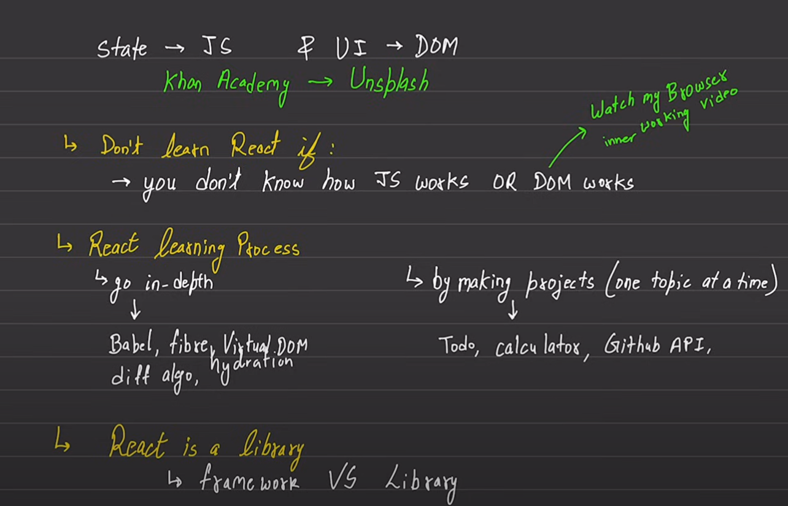
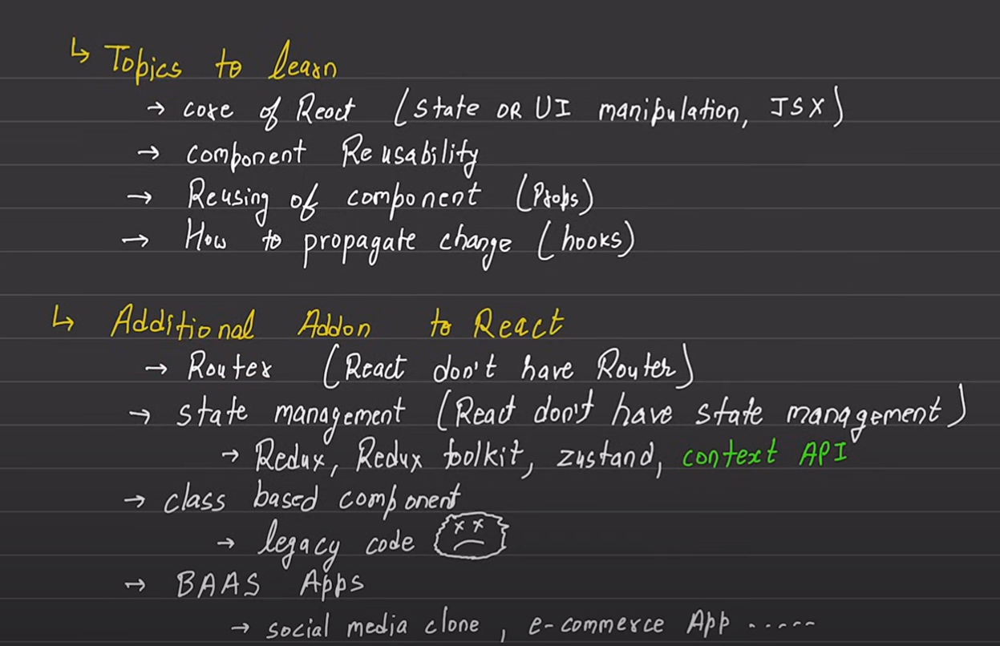
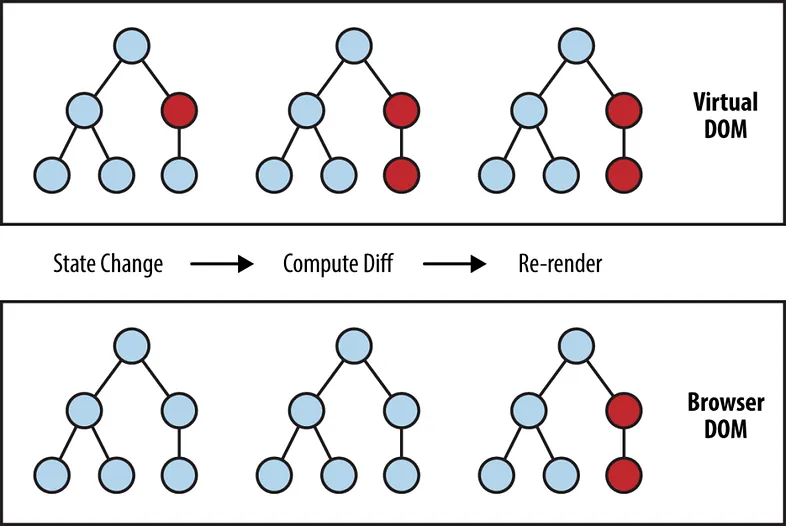

# React Revision Notes

### React Roadmap





---

### Create a React App

```
npm create vite@latest
```

---

### JavaScript ES6+ Concepts

1. **Arrow Functions**

   - **Syntax**: Arrow functions provide a concise way to write functions in JavaScript.

   ```javascript
   const add = (a, b) => a + b;
   ```

   - **No `this` Binding**: Arrow functions do not have their own `this` context; they inherit `this` from the enclosing lexical scope.
   - **Implicit Return**: If the function body contains a single expression, you can omit the `return` keyword and curly braces.

   ```javascript
   const square = (n) => n * n;
   ```

2. **Destructuring**

   - **Arrays**: Extract values from arrays into variables.

   ```javascript
   const [first, second] = [10, 20];
   ```

   - **Objects**: Extract values from objects into variables.

   ```javascript
   const { name, age } = { name: "Alice", age: 25 };
   ```

   - **Nested Destructuring**: You can also destructure nested objects and arrays.

   ```javascript
   const user = {
     name: "John",
     address: {
       city: "New York",
       zip: 10001,
     },
   };
   const {
     name,
     address: { city, zip },
   } = user;
   ```

3. **Template Literals**
   - **Syntax**: Template literals allow you to embed expressions within string literals using backticks (`` ` ``).
   ```javascript
   const name = "John";
   const greeting = `Hello, ${name}!`;
   ```
   - **Multi-line Strings**: Template literals make it easier to create multi-line strings.
   ```javascript
   const message = `This is a
   multi-line string.`;
   ```

---

### Components, JSX, and Props in React

1. **Components**

   - **Functional Components**: Components in React can be functions that return JSX.

   ```javascript
   function Welcome() {
     return <h1>Hello, World!</h1>;
   }
   ```

2. **JSX (JavaScript XML)**

   - **Syntax**: JSX is a syntax extension that allows you to write HTML-like code within JavaScript.

   ```javascript
   const element = <h1>Hello, World!</h1>;
   ```

   - **Embedding Expressions**: You can embed JavaScript expressions in JSX using curly braces `{}`.

   ```javascript
   const name = "John";
   const element = <h1>Hello, {name}</h1>;
   ```

   - **Attributes and Children**: JSX allows you to pass attributes and children to elements just like in HTML.

   ```javascript
   const element = <button onClick={handleClick}>Click me</button>;
   ```

3. **Props (Properties)**
   - **Passing Props**: Props are used to pass data from parent to child components.
   ```javascript
   function Greeting(props) {
     return <h1>Hello, {props.name}</h1>;
   }
   ```
   - **Default Props**: You can define default values for props in case they are not provided.
   ```javascript
   Greeting.defaultProps = {
     name: "Guest",
   };
   ```
   - **Prop Types**: Prop types help to enforce the types of props a component should receive.
   ```javascript
   Greeting.propTypes = {
     name: PropTypes.string,
   };
   ```

---

### Custom Rendering Function and React Elements

#### **Custom Rendering Function:**

- **Steps:**

  1. Create a DOM element using `document.createElement` based on the `type` specified in the React element.
  2. Set the inner HTML of the DOM element to the `children` of the React element.
  3. Loop through the `props` of the React element, setting each one as an attribute on the DOM element using `setAttribute`.
  4. Append the DOM element to the specified container.

- **Code Example:**

  ```javascript
  function customRender(reactElement, container) {
    const domElement = document.createElement(reactElement.type);
    domElement.innerHTML = reactElement.children;

    for (const prop in reactElement.props) {
      if (prop === "children") continue;
      domElement.setAttribute(prop, reactElement.props[prop]);
    }

    container.appendChild(domElement);
  }

  const reactElement = {
    type: "a",
    props: {
      href: "https://google.com",
      target: "_blank",
    },
    children: "Click me to visit google",
  };

  const mainContainer = document.querySelector("#root");
  customRender(reactElement, mainContainer);
  ```

#### **React Rendering:**

- **React.createElement**: This method is used to create a React element, which is an object representing a DOM node or a component.
- **Example:**

  ```javascript
  const reactElement = React.createElement(
    "a",
    { href: "https://google.com", target: "_blank" },
    "Click me to visit google"
  );
  ```

- **JSX Syntax**: Alternatively, JSX can be used to create React elements in a more readable and HTML-like syntax.

  ```javascript
  const anotherElement = (
    <a href="https://google.com" target="_blank">
      Visit google
    </a>
  );
  ```

- **Rendering with ReactDOM**: React elements can be rendered to the DOM using `ReactDOM.createRoot().render()`.
  ```javascript
  ReactDOM.createRoot(document.getElementById("root")).render(reactElement);
  ```

#### **Key Points:**

- The custom rendering function provides a manual way to render elements, similar to how React does it internally.
- `React.createElement` is used under the hood in JSX to create React elements.
- `ReactDOM.render` (or `createRoot().render`) is the standard way to render React elements into the DOM in a React application.

---

### State in React and the `useState` Hook

Components often need to change what’s on the screen as a result of an interaction. Typing into the form should update the input field, clicking “next” on an image carousel should change which image is displayed, clicking “buy” should put a product in the shopping cart. Components need to “remember” things: the current input value, the current image, the shopping cart. In React, this kind of component-specific memory is called state.

#### **Why Use State:**

```javascript
function Counter() {
  let count = 0; // Local variable

  const increment = () => {
    count += 1;
    console.log(count); // This will log the updated count, but...
  };

  return (
    <div>
      <p>Count: {count}</p> {/* This will always show 0 */}
      <button onClick={increment}>Increment</button>
    </div>
  );
}
```

The increment function is updating a local variable, count. But two things prevent that change from being visible:

- **Local variables don’t persist between renders.** Every time you click the "Increment" button, the increment function updates count, but since count is a local variable, it resets to 0 on each render. The displayed count remains 0 because React re-renders the component and reinitializes count.
- **Changes to local variables won’t trigger renders.** React only re-renders a component when there’s a change in its state or props. Changes to local variables do not trigger a re-render.

The `useState` Hook provides those two things:

- A state variable to retain the data between renders.
- A state setter function to update the variable and trigger React to render the component again.

#### **The `useState` Hook:**

- **Syntax**:
  ```javascript
  const [state, setState] = useState(initialValue);
  ```
  - `state`: The current state value.
  - `setState`: A function to update the state.
  - `initialValue`: The initial value of the state, which can be any data type.

**Counter with useState**

```jsx
import React, { useState } from "react";

function Counter() {
  const [count, setCount] = useState(0); // State variable with initial value 0

  const increment = () => {
    setCount((prevCount) => prevCount + 1); // Update state
  };

  return (
    <div>
      <p>Count: {count}</p> {/* This will display the updated count */}
      <button onClick={increment}>Increment</button>
    </div>
  );
}
```

---

### Virtual DOM, Fiber, and Reconciliation in React

#### **1. Virtual DOM:**

- The Virtual DOM is a lightweight, in-memory representation of the actual DOM (Document Object Model). React uses it to optimize updates to the real DOM.
- Instead of directly manipulating the DOM, React creates a virtual copy of it. When the state of a component changes, React updates the Virtual DOM first, and then determines the most efficient way to update the real DOM.

- The algorithm uses two main techniques to optimize updates:

  - **Tree diffing**: React compares the current virtual DOM tree with the updated virtual DOM tree, and identifies the minimum number of changes necessary to bring the virtual DOM in line with the updated state.

  - **Batching**: React batches multiple changes into a single update, reducing the number of updates to the virtual DOM and, in turn, the real DOM.

- **How It Works:**
  1. **Rendering**: React renders the UI to the Virtual DOM.
  2. **Diffing**: When state or props change, React compares the new Virtual DOM with the previous version (this process is called "diffing").
  3. **Reconciliation**: React determines the minimal number of changes needed to update the real DOM to match the new Virtual DOM.



#### **2. Reconciliation:**

- **What is Reconciliation?**

  - Reconciliation is the process by which React updates the DOM to match the current state of the application. It involves comparing the new Virtual DOM with the previous one and determining the most efficient way to update the real DOM.

- **How Reconciliation Works:**

  1. **Diffing**: React compares the new Virtual DOM tree with the previous one, node by node. This comparison is optimized using heuristics to minimize the number of changes.
  2. **Updating the Real DOM**: Based on the diffing process, React determines the minimal set of changes required to update the real DOM. These changes could involve adding, removing, or updating nodes.

- **Key Principles of Reconciliation:**

  - **Element Type**: If two elements have the same type, React assumes they represent the same DOM node, and it only updates the changed attributes.
  - **Keys**: React uses keys to identify elements in lists, which helps with efficient reordering and minimizing updates.

#### 3. React Fiber

React Fiber is a major reimplementation of the React core algorithm introduced in React 16. To understand Fiber and how it differs from the previous version, let's break it down in simple terms.

**i. React Before Fiber (Old Reconciliation Algorithm)**

Before Fiber, React used a reconciliation algorithm that operated in a synchronous, "all-or-nothing" manner. Here's how it worked:

- **Synchronous Rendering**: When React started rendering a component, it would render the entire component tree in one go, from top to bottom. If the tree was large or complex, this could take a while.
- **Blocking UI**: During this rendering process, the UI was blocked, meaning the browser couldn't do anything else (like responding to user input) until React finished rendering. This could lead to janky, unresponsive UIs, especially on slower devices.

**Example:**
Imagine you're updating a large list of items on a webpage. With the old algorithm, React would start rendering the updated list and wouldn't stop until it was done. If this took too long, the user might experience lag or unresponsiveness.

**ii. What is React Fiber?**

React Fiber is a complete rewrite of React’s reconciliation algorithm designed to address these issues. It introduces the concept of **incremental rendering**, allowing React to break down the rendering work into smaller chunks and spread it over multiple frames.

- **Incremental Rendering**: Fiber allows React to pause work, prioritize certain updates, and resume work later. This means React can handle more urgent tasks (like responding to user input) without waiting for the entire component tree to finish rendering.
- **Prioritization**: With Fiber, React can assign different priorities to different types of updates. For example, animations might be given a higher priority than data loading, ensuring a smooth user experience.
- **Time-Slicing**: React can break the rendering work into small units of work that fit within a frame. This prevents the UI from freezing because React can work on rendering in the background while still allowing the browser to handle user input.

**Example:**
Imagine you're updating the same large list of items. With React Fiber, React might render a few items, check if there's any urgent work to do (like handling a button click), and then continue rendering the list. The user won't experience any lag because React is handling updates in small, manageable chunks.

#### **iii. Key Differences: React Before and After Fiber**

| Feature                    | React Before Fiber (Old)                           | React Fiber (New)                             |
| -------------------------- | -------------------------------------------------- | --------------------------------------------- |
| **Rendering**              | Synchronous, blocking UI                           | Incremental, non-blocking UI                  |
| **Update Prioritization**  | No prioritization, all updates treated the same    | Updates can be prioritized (e.g., animations) |
| **Handling Large Updates** | Long tasks can block the main thread               | Time-slicing breaks tasks into smaller units  |
| **User Experience**        | Can be janky and unresponsive during heavy updates | Smoother, more responsive UI                  |

#### **iv. Real-World Example: A Search Bar**

- **Before Fiber:**
  Imagine a search bar that filters a large list of items. When the user types, React starts re-rendering the entire list based on the search input. If the list is large, this can cause noticeable lag, making the search bar feel slow.

- **With Fiber:**
  With Fiber, React can start rendering the filtered list in smaller chunks. While doing so, it can still handle other tasks, like processing additional keystrokes from the user. This results in a much smoother and responsive search experience.

#### **Key Takeaways:**

- **Virtual DOM**: A concept used by React to improve performance by minimizing direct DOM manipulations.
- **Fiber**: A new algorithm in React that improves responsiveness by breaking rendering work into small, interruptible units.
- **Reconciliation**: The process by which React updates the real DOM to match the current state of the Virtual DOM, ensuring minimal changes and efficient updates.

These concepts are fundamental to how React efficiently manages and updates the user interface, providing a smooth and responsive experience.

Youtube Video:

[A Cartoon Intro to Fiber - React Conf 2017](https://youtu.be/ZCuYPiUIONs?si=JoqnWC5nHc2V2g-D)

[React Fiber Deep Dive](https://youtu.be/0ympFIwQFJw?si=H_IRLKP_ZuH6l5zO)

---

### `useEffect` Hook

- `useEffect` is a hook in React that allows you to perform side effects in functional components.
- Side effects are actions that affect something outside the scope of a function, such as fetching data, updating the DOM, or setting up subscriptions.

##### **How `useEffect` Works:**

- **Syntax**:

  ```javascript
  useEffect(() => {
    // Side effect logic here

    return () => {
      // Cleanup logic here (optional)
    };
  }, [dependencies]);
  ```

  - **Callback Function**: The first argument to `useEffect` is a function that contains the side effect logic.
  - **Cleanup Function**: If your effect requires cleanup (e.g., removing event listeners), you return a cleanup function from the callback.
  - **Dependencies Array**: The second argument is an array of dependencies. The effect runs whenever the dependencies change. If omitted, the effect runs on every render. If an empty array is passed, the effect runs only once after the initial render.

##### **Examples of `useEffect`:**

- **Example 1: Data Fetching**
  ```javascript
  useEffect(() => {
    fetch("https://api.example.com/data")
      .then((response) => response.json())
      .then((data) => setData(data));
  }, []); // Empty array means this runs only once, on mount
  ```
- **Example 2: Cleanup with Event Listeners**

  ```javascript
  useEffect(() => {
    const handleResize = () => {
      console.log("Window resized");
    };

    window.addEventListener("resize", handleResize);

    return () => {
      window.removeEventListener("resize", handleResize); // Cleanup
    };
  }, []);
  ```

- React calls your setup and cleanup functions whenever it’s necessary, which may happen multiple times:

  1. Your setup code runs when your component is added to the page (mounts).
  2. After every re-render of your component where the dependencies have changed:
     - First, your cleanup code runs with the old props and state.
     - Then, your setup code runs with the new props and state.
  3. Your cleanup code runs one final time after your component is removed from the page (unmounts).

DOCS: [useEffect Docs](https://react.dev/reference/react/useEffect)

---

### `useRef` Hook

`useRef` is a React Hook that lets you reference a value that’s not needed for rendering. This object persists for the lifetime of the component.

##### **How `useRef` Works:**

- **Syntax**:
  ```javascript
  const myRef = useRef(initialValue);
  ```
  - `initialValue`: The value you want the ref object’s current property to be initially. It can be a value of any type. This argument is ignored after the initial render.
  - **`.current`**: The `.current` property of the ref object is mutable and can be updated without causing a re-render.

##### **Examples of `useRef`:**

- **Example 1: Accessing DOM Elements**

  ```javascript
  function FocusInput() {
    const inputRef = useRef(null);

    useEffect(() => {
      inputRef.current.focus(); // Focus the input element when the component mounts
    }, []);

    return <input ref={inputRef} type="text" />;
  }
  ```

  DOCS : [useRef Docs](https://react.dev/reference/react/useRef)

---

###`useCallback` Hook

##### **What is `useCallback`?**

- `useCallback` is a React Hook that lets you cache a function definition between re-renders.

- `useCallback` returns a memoized version of the callback function that only changes if one of the dependencies has changed. It helps optimize performance by preventing unnecessary re-creations of functions, especially in cases where those functions are passed as props to child components.

##### **How `useCallback` Works:**

- **Syntax**:

  ```javascript
  const memoizedCallback = useCallback(() => {
    // Callback logic here
  }, [dependencies]);
  ```

  - **Callback Function**: The first argument is the function that you want to memoize.
  - **Dependencies Array**: The second argument is an array of dependencies. The callback function will be re-created only when one of these dependencies changes.

- On the initial render, useCallback returns the function you have passed.

- During subsequent renders, it will either return an already stored function from the last render (if the dependencies haven’t changed), or return the fn function you have passed during this render.

##### **Examples of `useCallback`:**

- **Example: Memoizing a Function Passed as a Prop**

  ```javascript
  function ParentComponent() {
    const [count, setCount] = useState(0);

    const increment = useCallback(() => {
      setCount((prevCount) => prevCount + 1);
    }, []); // The function will not be recreated on every render

    return (
      <div>
        <p>Count: {count}</p>
        <ChildComponent onIncrement={increment} />
      </div>
    );
  }

  function ChildComponent({ onIncrement }) {
    console.log("ChildComponent re-rendered");
    return <button onClick={onIncrement}>Increment</button>;
  }
  ```

- **Without `useCallback`**: In the above example, without `useCallback`, the `increment` function would be re-created on every render of `ParentComponent`, causing `ChildComponent` to re-render unnecessarily.

DOCS: [useCallback](https://react.dev/reference/react/useCallback)

---
